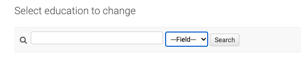

============================
Django Admin Search-by-Field
============================

Django Admin SBF is a Django admin app to customise the default search functionality to search by specific field instead
of all the fields. This helps in reducing the SQL query overload when there are too much data to process
and multiple fields to search from.

Detailed documentation is in the "docs" directory.

Quick start
-----------

1. Install

.. code-block::

    pip install django-admin-sbf

2. Add "django_admin_sbf" to your INSTALLED_APPS setting like this::

    INSTALLED_APPS = [
        ...
        'django_admin_sbf',
    ]

3. Extent the admin class for any model using `DjangoAdminSBF` instead of `ModelAdmin`

4. Define `search_fields` same as Django default.

Screenshots
-----------

Example
-------

.. code-block::

   @admin.register(Education)
   class EducationAdmin(DjangoAdminSBF):

       search_fields = [
           'course',
           'subject
       ]
